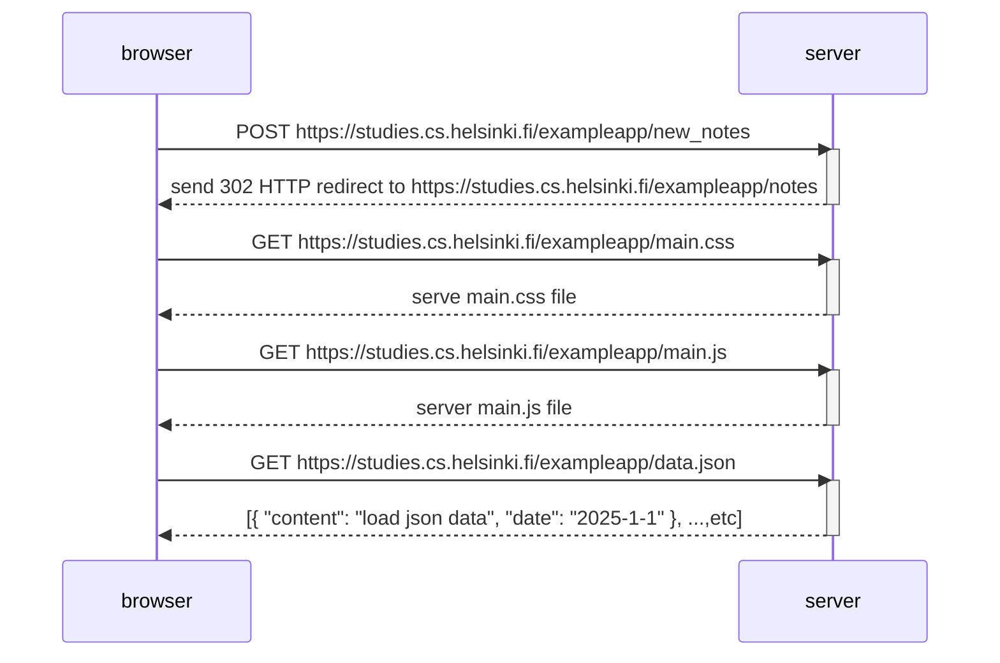

#answer for excercise 0.4 from part 0.

```mermaid
sequenceDiagram
  participant browser
  participant server

  
  #Note over browser,server:  user write note then click submit 'save' button. then,
  
  browser->>server: POST https://studies.cs.helsinki.fi/exampleapp/new_notes
  activate server
  server-->>browser: send 302 HTTP redirect  to https://studies.cs.helsinki.fi/exampleapp/notes
  deactivate server

  browser->>server: GET https://studies.cs.helsinki.fi/exampleapp/main.css
  activate server
  server-->>browser: serve main.css file
  deactivate server

  browser->>server: GET https://studies.cs.helsinki.fi/exampleapp/main.js
  activate server
  server-->>browser: server main.js file
  deactivate server

       
       #Note right of browser: here browser executes main.js file, also request for json data(from main.json).

  browser->>server: GET https://studies.cs.helsinki.fi/exampleapp/data.json
  activate server
  server-->>browser: [{ "content": "load json data", "date": "2025-1-1" }, ...,etc]
  deactivate server

    #Note right of browser: The browser executes the callback function that renders the notes

```
